# The Network State

A proposition is not a nation, though it can become one.

Here we describe a peaceful, reproducible process for turning an
online community premised on a proposition into a physical state with
a virtual capital: a _network state_, the sequel to the nation state.

A network state is a social network with a clear leader, an integrated
cryptocurrency, a definite purpose, a sense of national consciousness,
and a plan to crowdfund territory. That clear leader is the _founding
influencer_, who organizes the online community that eventually buys land
in the physical world. Crucially, that land is not necessarily
[contiguous](/how-to-start-a-new-country).

## An Archipelago of Digitally-Linked Enclaves

To visualize what this looks like, look at [Southeast
Asia](https://twitter.com/balajis/status/1430043293518221312) on a
map. Several of these countries are clusters of islands separated by
the ocean. 

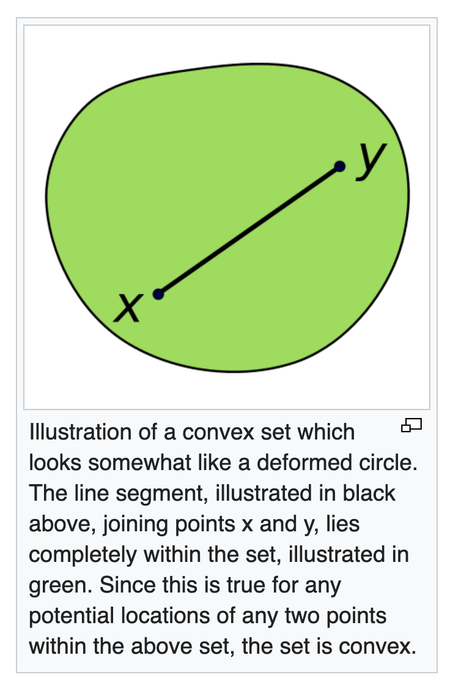
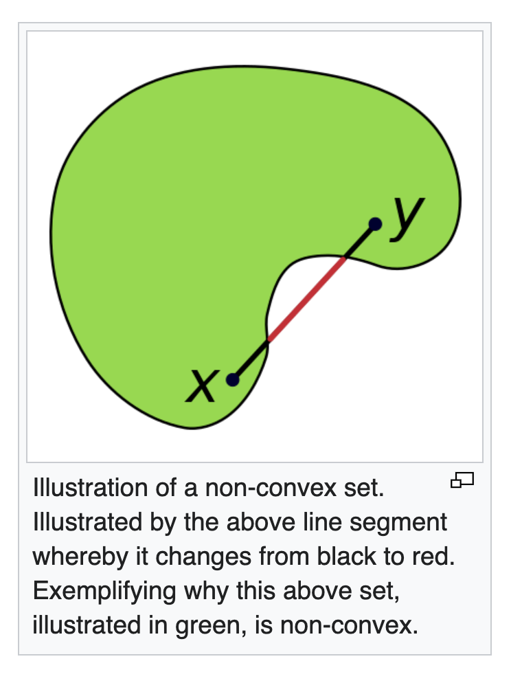

These aren't [convex
sets](https://en.wikipedia.org/wiki/Convex_set); for example, there
are pieces of Indonesia that are closer to Malaysia than to other
pieces of Indonesia. Still, on top of these geographical facts we
superimpose the abstraction of a nation state. Two people within the geographic boundaries of a state delimited on a
map are citizens of the same country, subject to the same law, with
logins on the same government services - even if one of these people
may be [physically
closer](https://www.wired.com/2013/11/software-is-reorganizing-the-world-and-cloud-formations-could-lead-to-physical-nations/)
to a citizen of another country than to their co-national.

What if we extend this concept? What if those islands were separated
not by the ocean, but by the internet — and scattered all around the
world? That's a visual of a network state. Contemporary precedents
include coworking communities and the [offices of
Google](https://about.google/locations/?region=europe&office=london-6ps):
globally distributed, networked real estate gated by the [common
login](https://venturebeat.com/2020/04/20/google-rolls-out-beyondcorp-for-secure-remote-network-access-without-a-vpn/)
of a corporate account.

A network state is thus an archipelago of digitally-linked enclaves.
It's also a country you can start from your computer, a territory one
can acquire but not conquer, a community aligned around cryptographic
consensus, a DAO that materializes in patches of earth, a city-state
in the cloud, a body based on math rather than science, a group
organized by geodesic over geographic distance, a polity that prizes
exit above voice, a state that recruits like a startup, and a nation
built from the internet rather than disrupted by it.

Each of these implicit definitions illuminates a different aspect of
the network state. Let's go through each of them in turn.

## A Country You Can Start From Your Computer
An important feature of the modern era is that you can boot up a
billion dollar company from a laptop, or a million person online
community. Anyone can choose to become a founder at any time, and take
on the [immense](https://a16z.com/2011/10/08/nobody-cares/)
[stress](https://future.a16z.com/the-entrepreneurial-struggle/) and
risk of trying to build something from scratch. Or they can choose to
remain a "citizen" and be gainfully employed by a founder, or by a
vehicle that a founder once [set up](/founding-vs-inheriting).

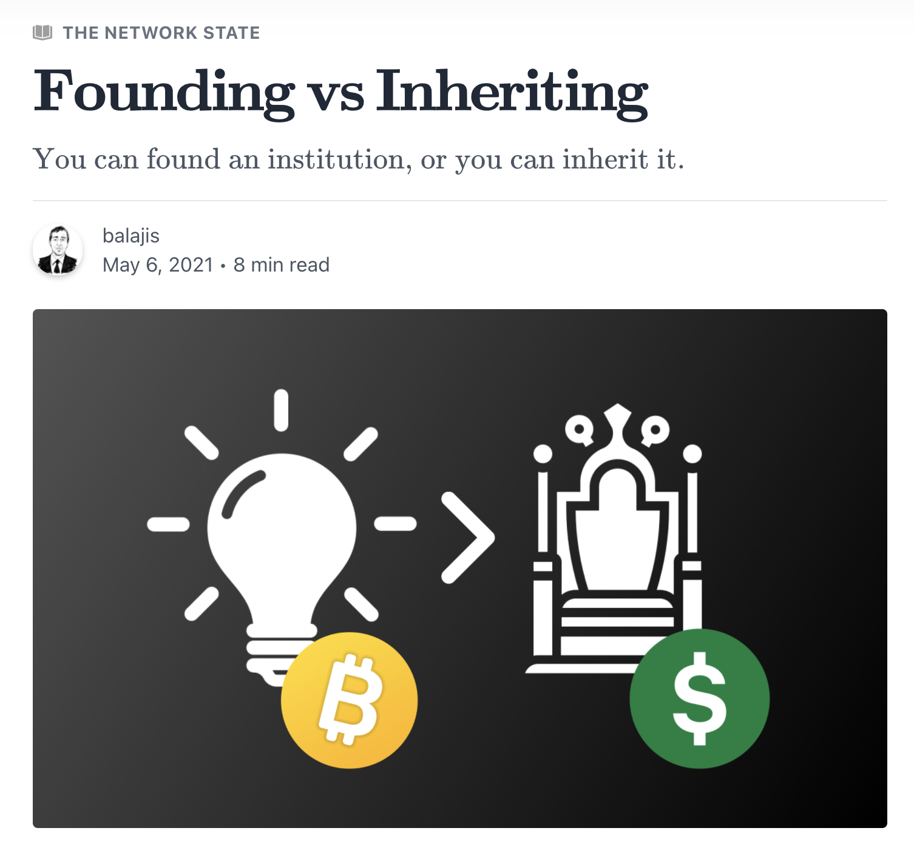

What if we could generalize that beyond companies and communities?

Suppose we separate the world into _founders_ of network states, and
_citizens_. Anyone can switch between these paths at any time, just
like you can go from being a Google employee to taking on the insanity
of founding a company, or transition from founding a company to
selling to Google, hanging up the cleats for a time, and enjoying the
easy life as an employee.

In other words, between any two moments in time, all four of the
following
[transitions](https://en.wikipedia.org/wiki/State-transition_table)
are possible:

 1. _Citizen to Founder_. You begin gathering an online community,
    write up a founding document, create a cryptocurrency, and declare
    your intent to start a network state. From today's perspective
    this seems quixotic. But think about Satoshi Nakamoto's plan to
    start a new currency in 2009, and how utopian it seemed at the
    time. If the process of instantiating the first network state
    meets with success, if this zero-to-one works, it will eventually
    become a template: a country anyone can start from your computer,
    beginning by building a following.

2. _Founder to Citizen_. You may not want to remain a founder forever.
    Heavy lies the crown! As we will see, unlike modern nation states,
    but like [historical
    ones](https://foreignpolicy.com/2012/06/05/why-dont-countries-buy-territory-like-they-used-to/),
    network states are built for full or partial M&A. So you can sell
    a network state to another network state, which transitions the
    logins of all your citizens to a new system. Or you can shut it
    down, ideally with some notice such that your citizens/users have
    time to find a new network state they can gain citizenship in.		

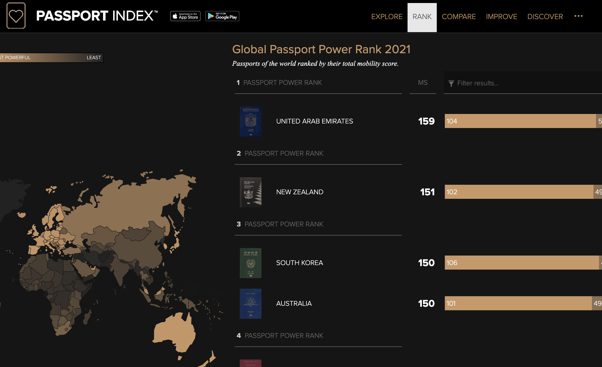

 2. _Citizen to Citizen_. You join a network state, and remain a
	citizen. Or you acquire dual citizenship, or N-th citizenship, in
	another network state - usually by buying and holding a sufficient
	amount of that network state's coin, as well as satisfying other
	requirements like [participation](https://poap.xyz) and
	[civility](https://twitter.com/balajis/status/1451354756639723523). Different
	network states may have different reciprocity provisions, just
	like nation states and social networks do. For example, a US
	passport allows you to enter some countries, but not others. And
	Quora allows you to login with Facebook or Google, but not vice
	versa.
	
	
	
 4. _Founder to Founder_. You continue running the network state you
	founded, or you sell it or shut it down and start a new
	one. Perhaps the first such state is focused on veganism, while
	the second on life extension. Just like Evan Williams did Blogger,
	then Twitter, then Medium - all iterations on a theme, each
	informed by the previous one - it may be possible for a suitably
	talented administrator to do the Plymouth Colony, then
	Massachusetts, then the US all within one lifetime. The v1, v2,
	and v3 of countries rather than companies. The history 
	[mid-1800s American
	communes](https://rowman.com/ISBN/9780739105207/All-Things-New-American-Communes-and-Utopian-Movements-1860-1914)
	is highly relevant.

The idea that anyone can become a founder of a network state is a
vision of global equality of opportunity. It is the modern version of
Jefferson's natural aristocracy. And it's an improvement over the
legitimating myth that "anyone can become president of the United
States", which isn't really true, as only ~4% of the world is American
and only a subset of those people satisfy the age, birth, and
residency [requirements](https://www.usa.gov/presidents) to become
president. 

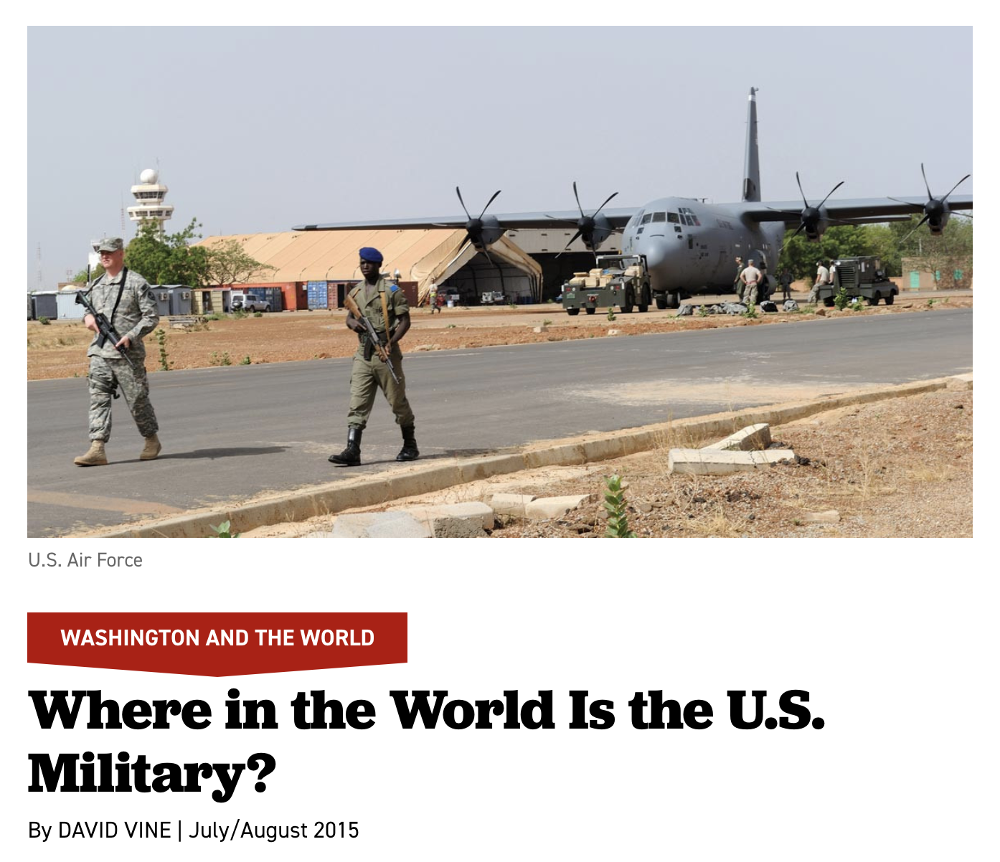

So long as the US still [rules the
world](https://www.politico.com/magazine/story/2015/06/us-military-bases-around-the-world-119321/),
this means that most of the people the US rules cannot themselves rise
to rule the US. In fact, once we realize that there have been only 46
US presidents (all of whom are American), but that there are thousands
of billionaires (most of whom are now [not
American](https://en.wikipedia.org/wiki/List_of_countries_by_number_of_billionaires)),
we realize that it is much more realistic to become a tech billionare
than to become president.

Similarly, now that Satoshi made it possible to start a new digital
currency, it is much easier to found a new cryptocurrency than to
become head of the Federal Reserve. The American establishment would
never have picked Vitalik Buterin over Jerome Powell, but the young
Canadian is on key dimensions a far more accomplished macroeconomist
than the American sexagenarian; Buterin founded an economy, while
Powell simply [inherited it](/founding-vs-inheriting).

So, instead of the false hope of getting elected US president, a role
available only to 40-something people in history, or the even more
difficult path of becoming Fed Chair, an opportunity for only 16
appointees, one can much more realistically found a billion dollar
company or coin from one's computer.

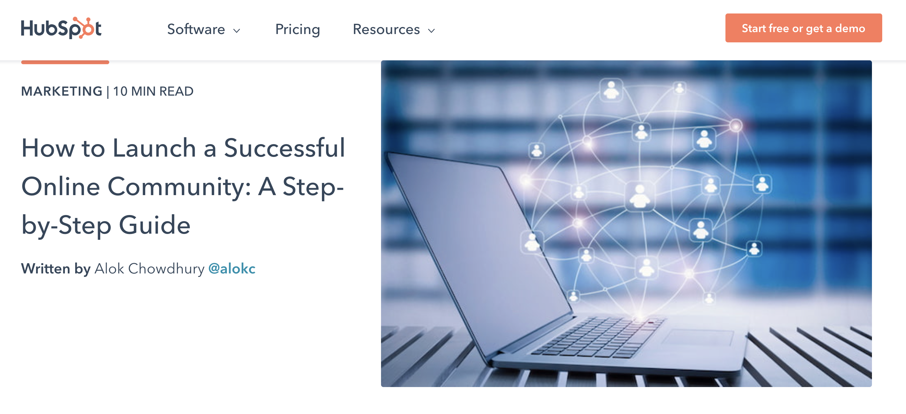

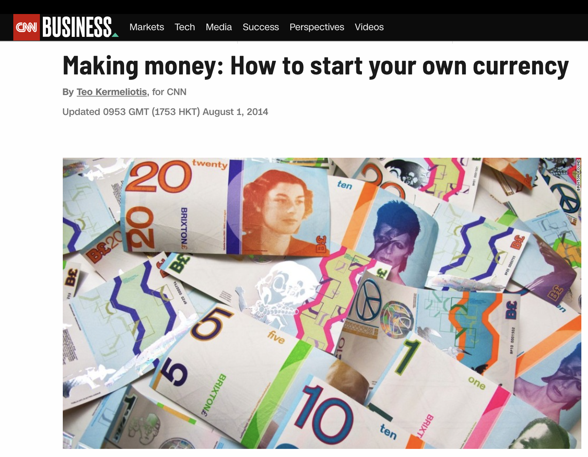

By extending this concept, we allow anyone in the world with an
internet connection (which will soon be everyone) to become not just a
tech founder, or a protocol founder, but a network state founder.
Whether the next Washington is Brazilian, Indian, Nigerian, or Eastern
European, this mechanism lets them rise to global leadership. It
permits a positive-sum avenue for the politically ambitious. But it
also allows anyone who doesn't desire the stress of leadership, or
just doesn't desire it at this point in time, to simply remain a
citizen and pick from the available nation and network state jurisdictions.

## A Territory One Can Acquire but Not Conquer
Once we visualize a network state as a combination of (a) a digital
social network with an integrated cryptocurrency and (b) a physical
network of distributed enclaves, we realize that it is much easier to
acquire than to conquer.

### Easy to Acquire
First, why is it easy to acquire? For the digital portion of a network
state, when the founder sells it to an acquirer, it's like selling
Instagram to Facebook. The digital logins of the two services are
integrated and citizens in each network state now have access to the
other's apps and physical territory. This is a modern analog to the
Louisiana Purchase or the purchase of Alaska. It's also feasible to
sell not the entire network, but simply a subnetwork - perhaps all
those in a defined geographical location, or all those who have
expressed a collective interest in changing citizenship. This is
similar to Singapore becoming independent from Malaysia. Finally, it
is also feasible to spin-off a subnetwork into its own network, like
the UK exiting from the EU.

If we visualize the physical portion of a network state as like a
network of Google offices, or a string of restaurant chains, or the
real estate footprint of a REIT, we see how we can handle the physical
component of network state M&A as well. In the simplest version, after
one network state consummates the acquisition of the other, all
citizens from one network state can enter the territory of the
other. The smart locks just get a software update and now open all the
doors and gates. The branding changes too, to be consistent with the
new unified entity, much like a large chain putting up new signage
when it acquires a small one. Various kinds of reciprocity
relationships with other network states may need to be renegotiated,
just like many corporate deals have change-of-control provisions, but
this too is straightforward so long as it is anticipated.

In theory, all of this can be done with current legal
infrastructure. It's just like one multinational acquiring the
digital, physical, and human resources of another, except it extends
to people's residences rather than simply their offices, and except
that the acquired people become not just employees of the combined
entity but citizens - though they can always leave for any new network
state that admits them.

Over time, however, the digital infrastructure for each network state
should live on a blockchain, which allows the recording of all real
estate transactions, the maintenance of all citizen records, and the
management of private keys in a globally consistent way across legacy
nation state jurisdictions. The problem of post-acquisition
integration mostly then reduces to porting over the records from one
blockchain to another.

This is then a way to extend the corporate concept of
change-of-control to polities. It's a recipe for nonviolent
competition between countries, where peace treaties between would-be
rebels and current incumbents are signed via M&A.

### Hard to Conquer
The network state reduces violence on another dimension: thanks to their
geographical decentralization and physical invisiblity, network
states are hard to conquer. 

First, geographical decentralization. If you look at a map of France
that includes its [islands in the South
Pacific](https://en.wikipedia.org/wiki/Overseas_France), you realize
that it's difficult to invade or nuke the whole thing at once. So the
geographical distribution of the network itself is a deterrent to
physical force. Just like cryptocurrency, the decentralization deters
violence.

Second, physical invisibility. This is much more subtle. Right now,
you can see the physical border zone between France & Germany on a
map. But you can't visualize the border zone between Twitter &
Facebook. That is, which people are on the "border" of Twitter and
Facebook, in the sense that they have accounts on both sites?

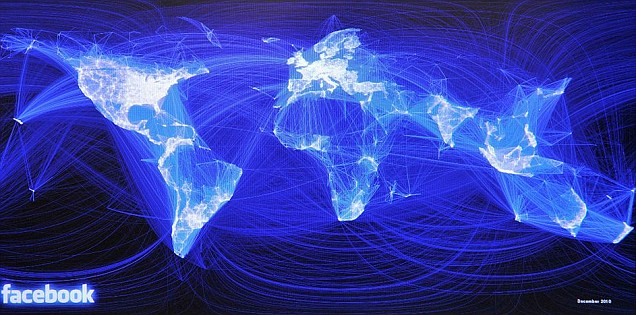

This might seem like a trivial concept, but isn't. The Twitter and
Facebook networks are each bigger than France or Germany -
combined. However, social network membership is invisible to all but
the network operators. There's no public list of all Facebook and
Twitter members. Only Facebook can generate a [map like
this](https://i.stack.imgur.com/6dXmx.jpg).

This has immense implications. You couldn't have nationalism itself
without maps of physical space. For example, think about 54° 40' or
Fight, which made literal reference to latitude. You couldn't have
that kind of border dispute without being able to visualize a
border. People had to see the map to be able to fight over it.

So, because citizenship in a network state is invisible to a
satellite, at least without the consent of the network state operator,
these [imagined
communities](https://en.wikipedia.org/wiki/Imagined_community) are
_[invisible
countries](https://yalebooks.yale.edu/book/9780300221626/invisible-countries)_. It's
the return of secret societies, at scale, as _secret
states_. Network states thus have the option of reducing violence by
encrypting the map itself; you can't hit what you can't see.

## A Group Organized By Geodesic Rather than Geographic Distance

Snapchat lies on a straight line with the dissolution of the nation
state. Why? Because people are sharing intimate moments with others
3000 miles away, while they often don't know the names of the next
door neighbors in their anonymous apartment complex. This undermines
the underlying assumption of the Westphalian nation state: namely,
that people who live near each other will share the same values and
therefore agree upon laws, such that the geographically-premised
mechanism of the nation state is the right entity to govern
them. Instead, what we find is that people share values with people
who are close to them in their social network...not in their physical
space.

We can quantify this with a little math. First, take a look at the
definitions for the [great circle
distance](https://en.wikipedia.org/wiki/Great-circle_distance) and the
[geodesic
distance](https://faculty.ucr.edu/~hanneman/nettext/C7_Connection.html#geodesic).

The geographic distance is the the distance between two points on the
surface of the earth. It's the distance as the crow flies. You can do
a modified version of this based on practical travel constraints, but
to a first approximation this fis how far apart people are in the
physical world. The geodesic distance, by contrast, is a completely
different metric. It's the number of degrees of separation between two
nodes in a social network along the shortest path.

Importantly, the geodesic distance is just as valid a [mathematical
metric](https://en.wikipedia.org/wiki/Metric_(mathematics)#Definition)
as the great-circle distance. That means one can generate [distance
matrices](https://en.wikipedia.org/wiki/Distance_matrix), and hence
maps, via techniques like [multidimensional
scaling](https://en.wikipedia.org/wiki/Multidimensional_scaling#Classical_multidimensional_scaling). In
fact, there are entire
[conferences](http://www.wikicfp.com/cfp/servlet/event.showcfp?eventid=21262&copyownerid=34837)
devoted to cloud cartography, in which
[research](http://vis.stanford.edu/jheer/projects/vizster/)
[groups](https://www.cmu.edu/joss/content/articles/volume1/Freeman.html)
present maps of online social networks - mapping not nation states but
states of mind.

Why is the geodesic distance important? Because the network state is
enabled in nontrivial part by the fact that we are transitioning from
a primarily great-circle-driven world to a geodesic-driven world. And
that means the fundamental division is less the visible geographic
borders of the nation state, than the invisible geodesic borders of
the social network. This in turn means that we need to reconceptualize
the state as a primarily digital entity, a _network state_.

Think about the difference between Russia vs Ethereum. Russia was a
geographical entity that switched its ideology in 1991, from communism
to nationalism. The geography was primary, the ideology was
secondary. Conversely, Ethereum is an ideological entity whose primary
existence is in a network. The Ethereum community holds meetups in
places like Cancun or Shenzhen, but the physical materialization is
evanescent while the digital community is persistent.

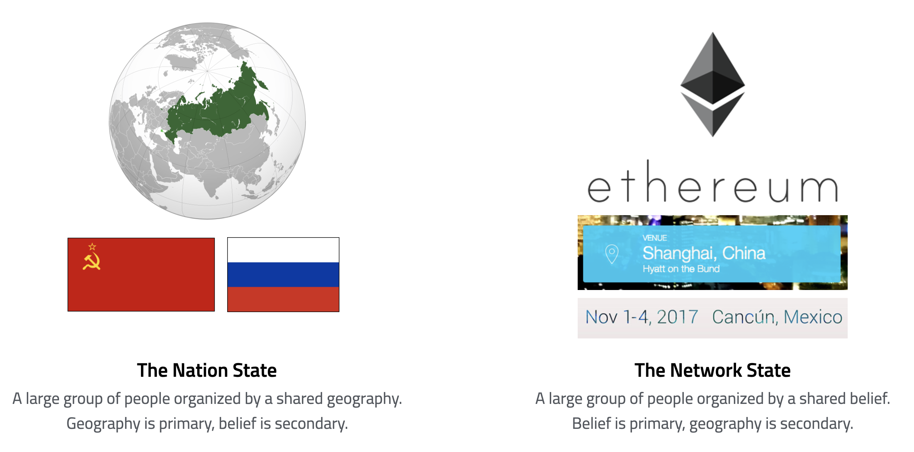

Or think about the fact that Russia's borders are (mostly) fixed,
while Ethereum's borders are highly fluid. It's true that Russia's
borders have changed since 1991; its predecessor state, the USSR,
extended farther out into Eastern Europe and Central Asia. But the
Russian people have been near the Baltics, the Turks, the Eastern
Europeans, and so on for quite a long time. Geopolitics doesn't vary
that much; Russia's "competitors" for citizens have mostly stayed the
same.

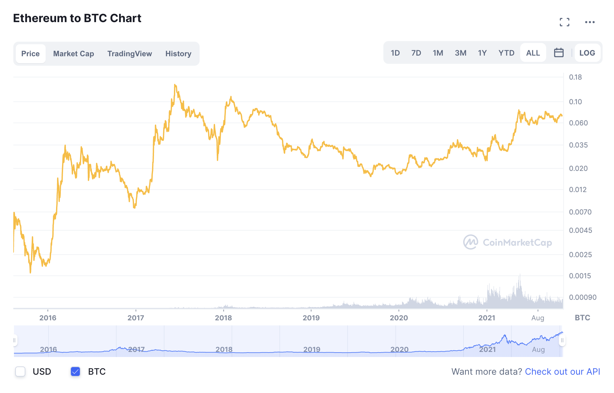

By contrast, the Ethereum-to-XYZ exchange rate _does_ vary quite a
bit, for different values of XYZ. Solana is a new digital currency
that has popped up on Ethereum's boundary and taken a good chunk of
"citizens" from it, just as Ethereum itself rose in BTC terms since
its inception. 

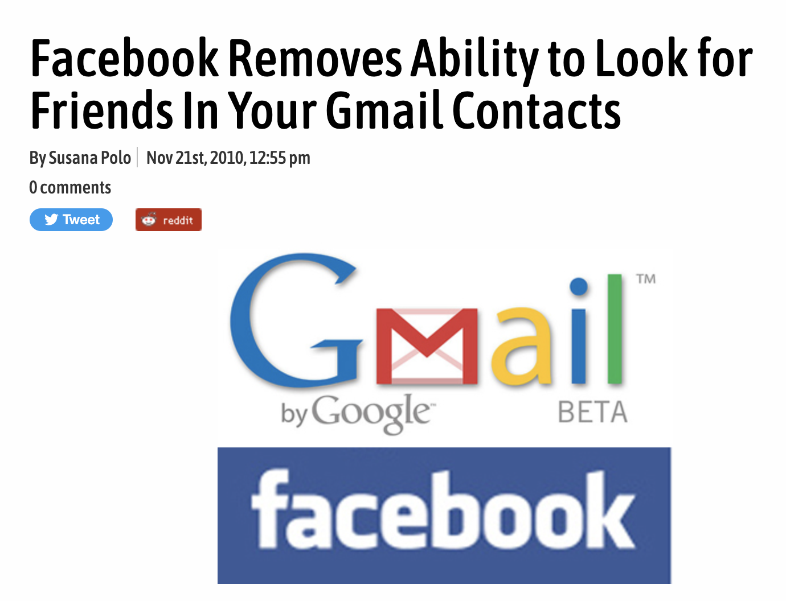

This is similar to how early Facebook arose out of
nowhere and took many citizens from Gmail, before Google "closed the
borders". Of course, unlike territorial disputes, these games are not
strictly zero-sum, as the space of cryptocurrency and internet users
keeps expanding, as does the wealth to invest in different services.

It is the geodesic distance that enables this fluidity. Individuals
and entire networks can instantly become adjacent to anyone else in a
social network. Individuals can also move around the map to become
adjacent to others in the physical world. But unlike individuals or
networks, nation states cannot do this. They cannot just move around
the map at will. The Russian state is mostly stuck with its neighbors
in a way that individual Russians, or the Telegram and Ethereum
networks (both founded by people of Russian descent), are not.

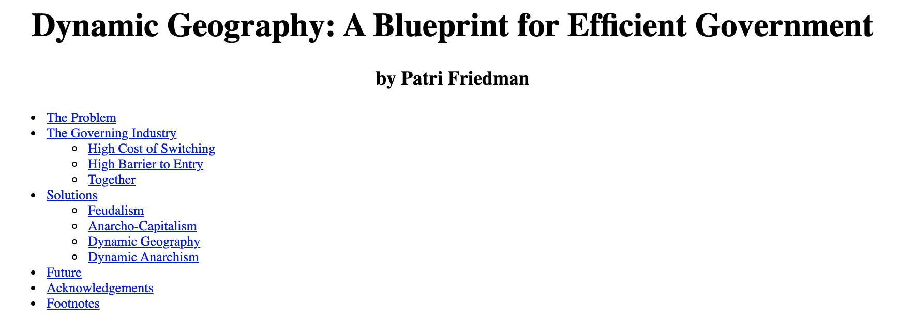

We can term this concept _dynamic digital geography_, after a term
Patri Friedman
[introduced](https://patrifriedman.com/old_writing/dynamic_geography.html). He
used it for seasteading, but it's easier to accomplish in the digital
world. And the popularization of the metaverse makes this more than a
metaphor; the digital territory a network inhabits can instantly be
picked up and made adjacent to any other with the press of a key, just
like moving a cruise ship around the world, but even more cheaply and
quickly.

## Next Steps
To be continued! See [github.com/1729/content/issues](https://github.com/1729/content/issues) for how you can help.
